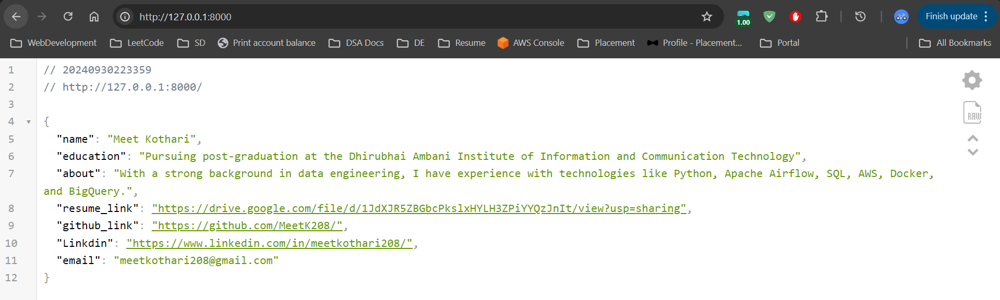
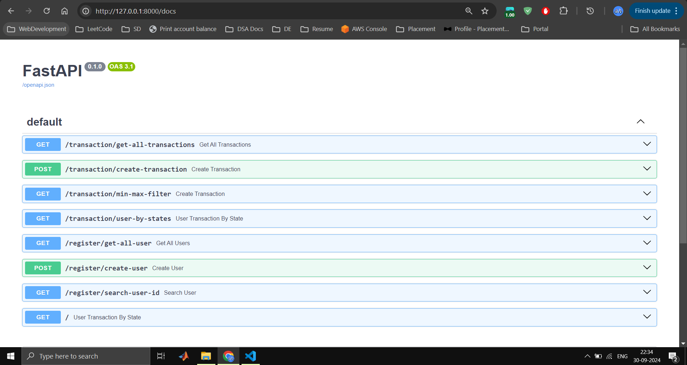
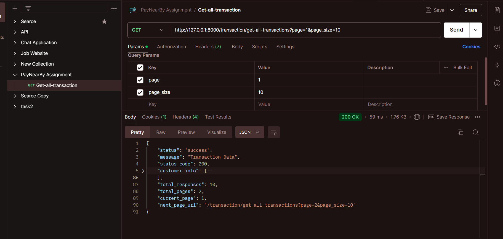
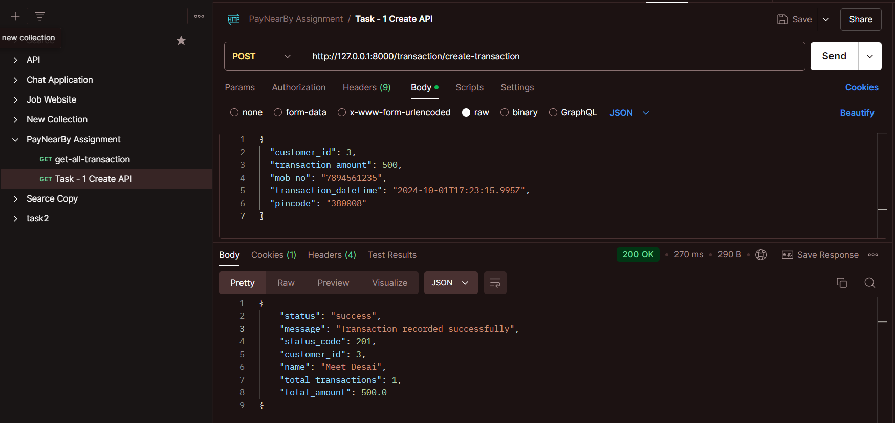
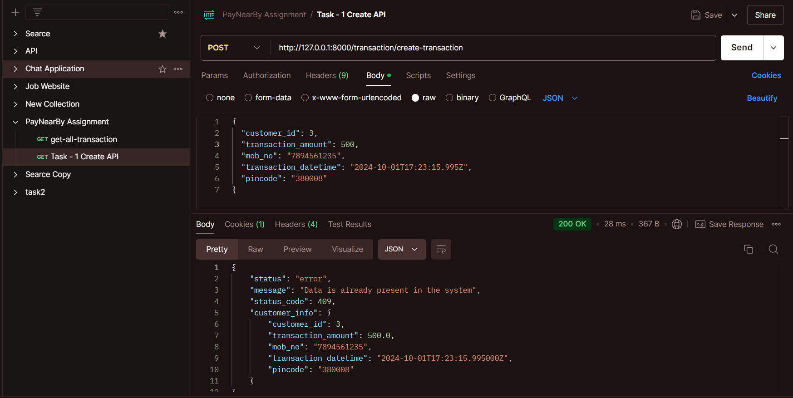
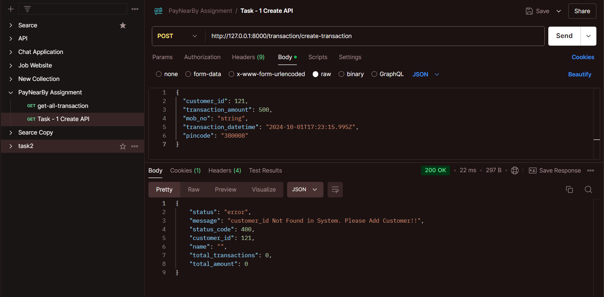
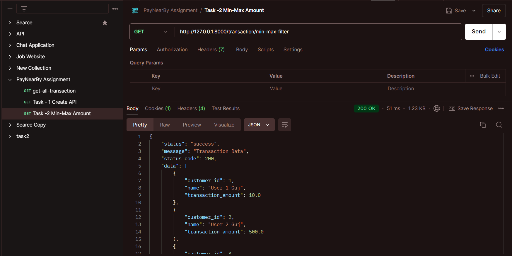
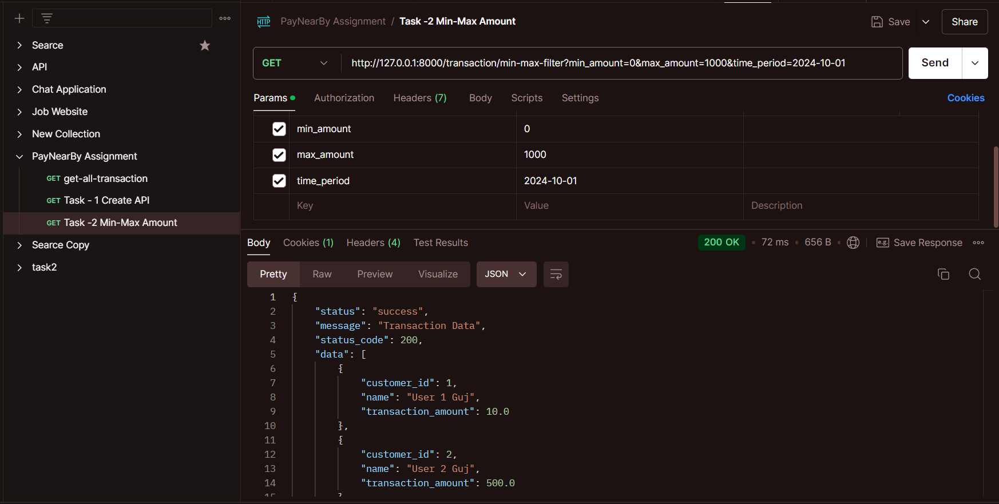
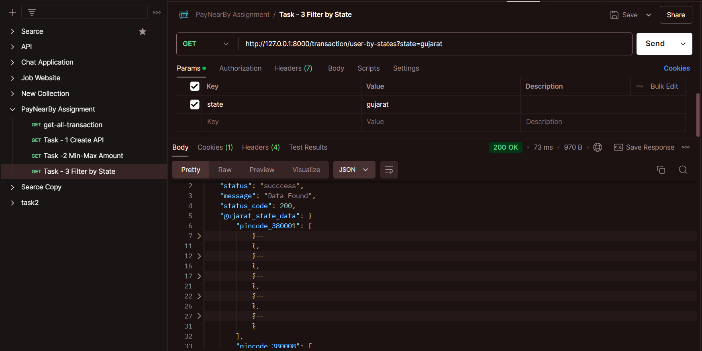

Base URL Page with My Introduction

API Documentation:

- All available APIs in my system are documented here.

View All Transactions for a Customer in a System

- A screenshot of the Postman interface showing how to view all transactions created by any customer.

Task 1: API Creation

- API developed for Task 1, demonstrating the creation of a new entry.

Task 1: API with Duplicate Entry

- This screenshot shows how the API handles the creation of a duplicate entry.

Task 2: Customer Not Found

- Error message displayed when a customer ID is not found. The customer needs to be registered using the 'Create User' API.

Task 2: Default Filter

- Without specifying a minimum-maximum amount or date range, the API fetches all data to date.

Task 2: Filter by Min-Max Amount and Date Range

- Data output after applying a minimum-maximum amount filter and date range in the parameters.

Task 3: Top 5 Transacting Customers per Pincode in a Given State

- API developed to return the top 5 transacting customers per pincode in a specified state.
